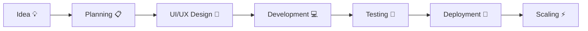

<div align="center">

# 👨‍💻 Vamsi Valluri

### AI Engineer • Full Stack Developer • MERN Stack Developer


<p align="center">


</p>

</div>

---

# 🚀 About Me

🎓 B.Tech Artificial Intelligence Student at **Parul University**

💡 Passionate Full Stack Developer and AI Enthusiast focused on building scalable web applications, backend systems, and AI-powered solutions.

🔹 Skilled in MERN Stack Development, REST APIs, Authentication Systems, and Backend Architecture.

🔹 Strong problem-solving skills with hands-on experience in Java DSA, Python, SQL, and modern web technologies.

🔹 Interested in AI Integrations, Cloud Deployment, DevOps, and scalable system design.

🔹 Open to internships, freelance opportunities, open-source collaborations, and full-time software engineering roles.

---

# 🌐 Connect With Me

<div align="center">

<a href="mailto:vamsivalluri52@gmail.com">

</a>

<a href="https://github.com/vamsivalluri-19">

</a>

<a href="https://www.linkedin.com/in/valluri-vamsi-445bab338/en/?skipRedirect=true">

</a>

<a href="https://leetcode.com/u/vamsi_valluri/">

</a>

<a href="https://www.hackerrank.com/profile/valluri1912">

</a>

</div>

---

# 💻 Technical Skills

<div align="center">

## 🚀 Programming Languages


## ⚡ Professional Skills

```yaml
Programming Languages:
  - Java
  - Python
  - JavaScript
  - TypeScript
  - SQL
  - C

Frontend Development:
  - React.js
  - Next.js
  - HTML5
  - CSS3
  - Tailwind CSS
  - Bootstrap

Backend Development:
  - Node.js
  - Express.js
  - Django
  - Flask
  - FastAPI
  - REST APIs
  - Authentication & Authorization

Databases:
  - MongoDB
  - MySQL
  - PostgreSQL

AI & Data Science:
  - NumPy
  - Pandas
  - OpenCV
  - AI Fundamentals
  - Prompt Engineering
  - Machine Learning Basics

DevOps & Cloud:
  - Docker
  - Kubernetes
  - AWS Basics
  - Redis
  - Render
  - Vercel

Tools & Platforms:
  - Git
  - GitHub
  - VS Code
  - Postman
  - Firebase
  - PowerShell
  - Figma
```

---

## ⚙️ Frameworks & Libraries


---

## 🛠 Tools & Platforms


</div>

---

# 🏆 LeetCode & Competitive Programming

<div align="center">


<br><br>


<br><br>


<br><br>

### 🚀 DSA & Competitive Programming

```yaml
Focus Areas:
  - Data Structures & Algorithms
  - Dynamic Programming
  - Graph Algorithms
  - Trees & Binary Trees
  - Sliding Window
  - Recursion & Backtracking
  - SQL Problem Solving
  - System Design Basics
```

<a href="https://leetcode.com/u/vamsi_valluri/">

</a>

</div>

---

# 🚀 Featured Projects

<div align="center">

<table>
<tr>
<td width="50%">

## 🤖 GenAI Placement Management System

🔹 AI-powered placement platform
🔹 Resume Analysis & Analytics
🔹 OTP/OAuth Authentication
🔹 Real-time placement workflows
🔹 Modern MERN architecture

### ⚡ Features

* Student & Recruiter Dashboards
* ATS Resume Analysis
* AI Chatbot Assistance
* Placement Analytics
* Secure Authentication

<a href="https://github.com/vamsivalluri-19/gen-ai-placement-management-system">

</a>

</td>

<td width="50%">

## 🌾 Satellite Crop Health Monitoring

🔹 AI-powered farming platform
🔹 Satellite crop analysis
🔹 Disease prediction system
🔹 Weather forecasting insights
🔹 Smart crop recommendations

### ⚡ Features

* Soil Monitoring
* AI Disease Detection
* Smart Recommendations
* Satellite Mapping
* Farmer Dashboard

<a href="https://github.com/vamsivalluri-19/Satellite-Crop-Health">

</a>

</td>
</tr>

<tr>
<td width="50%">

## ✂️ SmartCrop AI Platform

🔹 AI image/video cropping
🔹 Automated workflows
🔹 Responsive dashboard
🔹 Optimized performance UI

### ⚡ Features

* AI Smart Detection
* Auto Cropping
* Video Processing
* Cloud Media Storage
* Responsive UI

<a href="https://github.com/vamsivalluri-19/SmartCrop">

</a>

</td>

<td width="50%">

## 🎓 Online Skill Platform

🔹 Skill learning ecosystem
🔹 Authentication & dashboards
🔹 Scalable backend architecture
🔹 Modern responsive UI

### ⚡ Features

* Video Learning
* Course Management
* User Authentication
* Student Dashboards
* Admin Controls

<a href="https://github.com/vamsivalluri-19/online-skill-platform">

</a>

</td>
</tr>
</table>

</div>

---

# 🚀 Key Projects

<div align="center">


</div>

---

# 📂 More Projects

<div align="center">

| 🚀 Project                          | 💻 Tech Stack          | 🔥 Description                                                    |
| ----------------------------------- | ---------------------- | ----------------------------------------------------------------- |
| **Rock Paper Scissor Game**         | HTML, CSS, JavaScript  | Interactive game with modern UI                                   |
| **Advanced Calculator**             | HTML, CSS, JavaScript  | Smart calculator with themes, memory functions & keyboard support |
| **Tic Tac Toe**                     | HTML, CSS, JavaScript  | Responsive multiplayer tic tac toe game                           |
| **Fake Profile Detection**          | JavaScript             | AI-based fake social profile detection system                     |
| **NutriMind AI**                    | MERN, TypeScript, AI   | AI-powered nutrition recommendation platform                      |
| **House Price Prediction**          | Python, ML, HTML, CSS  | Machine learning based property price prediction system           |
| **TripMate**                        | Python, HTML, CSS, JS  | Smart travel planning & recommendation platform                   |
| **GEN AI PMS**                      | Node.js, MERN          | AI placement management system with analytics                     |
| **Notes App**                       | MERN Stack, MongoDB    | Secure cloud notes application                                    |
| **Crime Detection**                 | MERN Stack, JavaScript | Crime analysis and detection system                               |
| **Portfolio Website**               | HTML, CSS              | Personal developer portfolio website                              |
| **Online Quiz System**              | HTML, CSS, JavaScript  | Dynamic quiz platform with score tracking                         |
| **Heart Disease Prediction System** | AI, JavaScript         | Disease prediction using AI & analytics                           |
| **Satellite Crop Health**           | Python, AI, JS         | Crop monitoring & disease detection platform                      |
| **AI Placement Portal**             | HTML, CSS, JavaScript  | Placement workflow & recruitment portal                           |
| **Online Job Portal**               | Python, SQL, HTML, CSS | Job application and recruitment management platform               |

</div>

---

# 📌 Career Objective

```yaml
Seeking Opportunities In:
  - Software Development Engineer (SDE)
  - Full Stack Development
  - Backend Development
  - AI/ML Engineering
  - MERN Stack Development
  - Open Source Contributions
```

---

# 📊 GitHub Analytics

<div align="center">


<br><br>


</div>

---

# 📈 Contribution Graph

<div align="center">


</div>

---

# 🏆 GitHub Achievements

<div align="center">


</div>

---

# 📚 Certifications

<div align="center">

| Certification                          | Platform       |
| -------------------------------------- | -------------- |
| 🏅 Full Stack Web Development Bootcamp | Udemy          |
| 🏅 Machine Learning Using Python       | Simplilearn    |
| 🏅 SQL Database Certification          | Udemy          |
| 🏅 Backend Development                 | Coursera       |
| 🏅 AI & Deep Learning Fundamentals     | Great Learning |

</div>

---

# 🎯 Current Focus

```yaml
focus:
  - Full Stack Development
  - MERN Stack Projects
  - Backend Architecture
  - AI-Powered Applications
  - Data Structures & Algorithms
  - Scalable Systems
  - DevOps & Deployment
```

---

# 🧠 Developer Workflow



---

# 🐍 Contribution Snake

<div align="center">


</div>

---

# 💡 Motto

<div align="center">

> "Code. Build. Solve. Scale."

</div>

---

# 📬 Contact Me

<div align="center">

📧 **Email:** [vamsivalluri52@gmail.com](mailto:vamsivalluri52@gmail.com)
💼 **LinkedIn:** [https://www.linkedin.com/in/valluri-vamsi-445bab338/](https://www.linkedin.com/in/valluri-vamsi-445bab338/)
💻 **GitHub:** [https://github.com/vamsivalluri-19](https://github.com/vamsivalluri-19)
🧠 **LeetCode:** [https://leetcode.com/u/vamsi_valluri/](https://leetcode.com/u/vamsi_valluri/)

### 🚀 Open to:

* Software Engineering Internships
* Full-Time Developer Roles
* AI & Full Stack Projects
* Open Source Collaborations

</div>

---

<div align="center">

## ⭐ Thanks for Visiting My Profile


<br><br>


</div>
