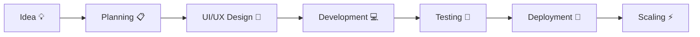

#  Hey, I'm Vamsi Valluri

<div align="center">


<p align="center">


</p>

</div>

---

# 🚀 About Me


🎓 B.Tech Artificial Intelligence Student at **Parul University**

💻 Passionate about:
- Full Stack Development
- Backend Systems
- AI Applications
- Scalable Architectures
- System Design

🚀 Building modern AI-powered MERN stack applications with scalable backend systems and modern UI/UX.

📚 Strong in:
- Java DSA
- Python
- SQL
- REST APIs
- Authentication Systems
- Problem Solving

🌱 Currently Exploring:
- Cloud Deployment ☁️
- AI Integrations 🤖
- DevOps ⚙️
- Microservices 🚀
- Scalable Backend Systems

⚡ Fun Fact:
> I love transforming innovative ideas into scalable AI-powered applications.

---


# 🌐 Connect With Me

<div align="center">

<a href="mailto:vamsivalluri52@gmail.com">

</a>

<a href="https://github.com/vamsivalluri-19">

</a>

<a href="https://www.linkedin.com/in/valluri-vamsi-445bab338/en/?skipRedirect=true">

</a>

<a href="https://leetcode.com/u/vamsi_valluri/">

</a>

<a href="https://www.hackerrank.com/profile/valluri1912">

</a>

</div>

# 💻 Tech Stack

<div align="center">

## 🚀 Languages


---

## ⚙️ Frameworks & Libraries


---

## 🛠 Tools & Platforms


---

## ☁️ Currently Learning


</div>

---

# 🚀 Featured Projects

<div align="center">

<table>
<tr>
<td width="50%">

## 🤖 GenAI Placement Management System

🔹 AI-powered placement platform  
🔹 Resume Analysis & Analytics  
🔹 OTP/OAuth Authentication  
🔹 Real-time placement workflows  
🔹 Modern MERN architecture  

### ⚡ Features
- Student & Recruiter Dashboards
- ATS Resume Analysis
- AI Chatbot Assistance
- Placement Analytics
- Secure Authentication

<a href="https://github.com/vamsivalluri-19/gen-ai-placement-management-system">

</a>

</td>

<td width="50%">

## 🌾 Satellite Crop Health Monitoring

🔹 AI-powered farming platform  
🔹 Satellite crop analysis  
🔹 Disease prediction system  
🔹 Weather forecasting insights  
🔹 Smart crop recommendations  

### ⚡ Features
- Soil Monitoring
- AI Disease Detection
- Smart Recommendations
- Satellite Mapping
- Farmer Dashboard

<a href="https://github.com/vamsivalluri-19/Satellite-Crop-Health">

</a>

</td>
</tr>

<tr>
<td width="50%">

## ✂️ SmartCrop AI Platform

🔹 AI image/video cropping  
🔹 Automated workflows  
🔹 Responsive dashboard  
🔹 Optimized performance UI  

### ⚡ Features
- AI Smart Detection
- Auto Cropping
- Video Processing
- Cloud Media Storage
- Responsive UI

<a href="https://github.com/vamsivalluri-19/SmartCrop">

</a>

</td>

<td width="50%">

## 🎓 Online Skill Platform

🔹 Skill learning ecosystem  
🔹 Authentication & dashboards  
🔹 Scalable backend architecture  
🔹 Modern responsive UI  

### ⚡ Features
- Video Learning
- Course Management
- User Authentication
- Student Dashboards
- Admin Controls

<a href="https://github.com/vamsivalluri-19/online-skill-platform">

</a>

</td>
</tr>
</table>

</div>

---

# 📊 GitHub Analytics

<div align="center">


<br><br>


</div>

---

# 📈 Contribution Graph

<div align="center">


</div>

---

# 🏆 GitHub Achievements

<div align="center">


</div>

---

# ⚡ GitHub Metrics

<div align="center">


</div>

---

# 📚 Certifications

<div align="center">

| Certification | Platform |
|---|---|
| 🏅 Full Stack Web Development Bootcamp | Udemy |
| 🏅 Machine Learning Using Python | Simplilearn |
| 🏅 SQL Database Certification | Udemy |
| 🏅 Backend Development | Coursera |
| 🏅 AI & Deep Learning Fundamentals | Great Learning |

</div>

---

# 🎯 Current Focus

```yaml
focus:
  - Full Stack Development
  - MERN Stack Projects
  - Backend Architecture
  - AI-Powered Applications
  - Data Structures & Algorithms
  - Scalable Systems
  - DevOps & Deployment
```

---

# ⚡ Coding Profiles

<div align="center">

<a href="https://leetcode.com/u/vamsi_valluri/">

</a>

<br><br>

<a href="https://leetcode.com/u/vamsi_valluri/">

</a>

<a href="https://www.hackerrank.com/profile/valluri1912">

</a>

</div>

---

# 🧠 Developer Workflow



---

# 🐍 Contribution Snake

<div align="center">


</div>

---

# 💡 Quote Of The Day

<div align="center">

> ### "Code. Learn. Build. Scale. Repeat."

</div>

---

# ☕ Support Me

<div align="center">

<a href="https://github.com/sponsors">

</a>

<a href="https://buymeacoffee.com/">

</a>

</div>

---

# 📬 Let's Collaborate

<div align="center">

💼 Open for:
- Full Stack Projects
- AI Collaborations
- Open Source Contributions
- Freelance Opportunities

📧 Reach me at:
### **vamsivalluri52@gmail.com**

</div>

---

<div align="center">

## ⭐ Thanks for Visiting My Profile


<br><br>


</div>
